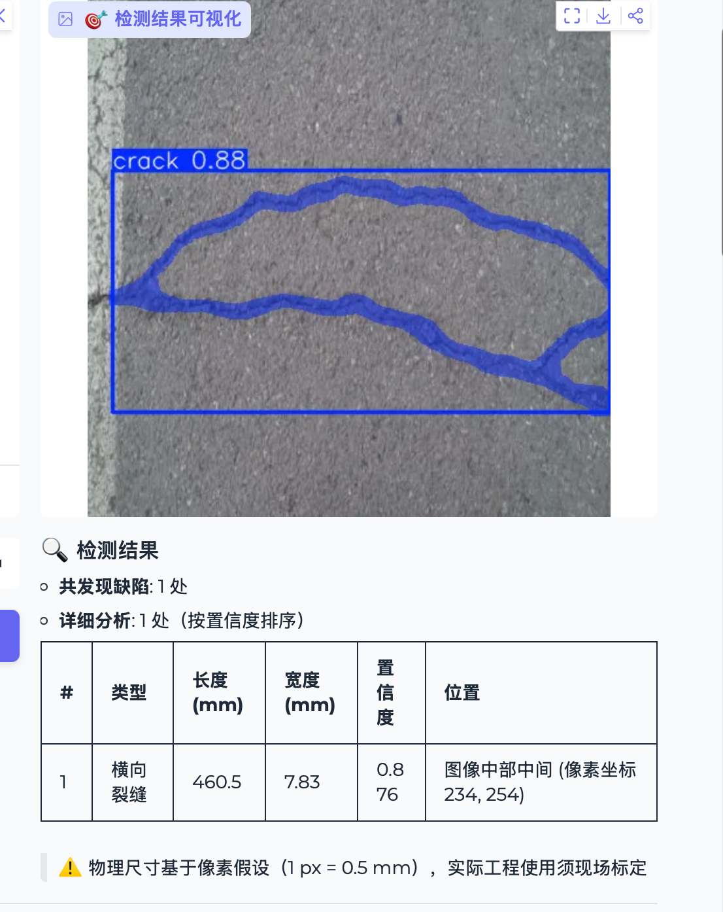
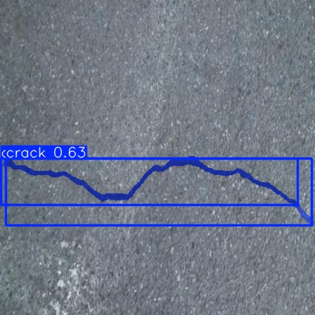
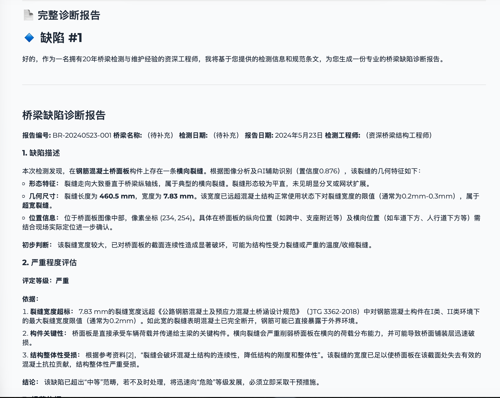

# 🌉 BridgeMind

> **多模态大模型驱动的桥梁缺陷智能诊断系统**
> Multi-modal LLM-driven bridge defect diagnosis system

---

## 🎬 演示视频

👉 [**点击观看 60s 完整演示（Bilibili）**]https://www.bilibili.com/video/BV19JL46ME1r

> 演示流程：上传桥梁照片 → YOLO 检测裂缝 → 自动提取几何特征 → RAG 检索规范 → DeepSeek 生成 5 章节诊断报告

---

## 💡 项目简介

BridgeMind 是一个端到端的桥梁缺陷智能诊断系统，将桥梁巡检照片自动转化为符合工程规范的专业诊断报告。

**核心问题**：传统桥梁缺陷分析高度依赖专家经验，AI 模型给出的检测结果（如 YOLO bbox）与可用的工程报告之间存在 **语义鸿沟**。本项目通过 RAG + LLM + 领域 Prompt 工程，将"AI 看到了什么"自动转化为"工程师该做什么"。

---

## 🎨 系统截图

### Web 界面（Gradio）

### YOLO 检测效果

### 自动生成的诊断报告

---

## 🏗️ 系统架构

\`\`\`
📸 输入图像
   ↓
🔍 YOLO11s-seg 检测（11K 数据集微调, mAP@0.5 = 0.69）
   ↓
📐 几何特征提取（skeletonize 算法估算长度/宽度）
   ↓
📚 RAG 知识库检索（LlamaIndex + BGE-small-zh）
   ↓
🤖 DeepSeek-V3 生成 5 章节专业报告
   ↓
📄 标注图 + Markdown 报告
\`\`\`

---

## 📊 模型性能

YOLO11s-seg 在 11K+ 张多源融合裂缝数据集（CFD/CRACK500/GAPs384 等）上 50 epoch 微调：

| 指标 | 数值 | 备注 |
|------|------|------|
| Box mAP@0.5 | **0.688** | 接近论文级 |
| Box mAP@0.5:0.95 | **0.485** | 严格 IoU 下表现 |
| Mask mAP@0.5 | **0.561** | 像素级分割 |
| Box Precision | **0.788** | 误报率低 |
| Box Recall | **0.596** | 召回率 |
| 推理速度 | **3.1 ms/img** | Tesla T4 |

完整训练记录见 [TRAINING_LOG.md](./TRAINING_LOG.md)。

---

## 🎯 核心技术亮点

### 1. 几何后处理（避免 CV→工程语义鸿沟）

YOLO 输出的 bbox 直接换算成"裂缝宽度"会导致严重失真（实测误差可达 40 倍）。本项目采用 **skeletonize** 算法提取裂缝中线，用 `面积 / 中线长度` 估算真实宽度，得到工程可用的尺寸数据。

### 2. 幻觉控制（Prompt 工程）

DeepSeek 在生成报告时被严格要求：
> "如规范资料中无明确依据，须明确说明'参考资料中未找到直接相关条文'，禁止编造规范名称或条文号"

实测：当 RAG 检索证据不足时，模型主动声明 **而非伪造**，显著提升报告可信度。

### 3. 多源融合数据集

合并 5 个公开裂缝数据集（CFD、CRACK500、GAPs384、AEL、cracktree200）共 11,098 张图，含 noncrack 负样本，提升模型在不同拍摄条件下的鲁棒性。

---

## 🚀 快速开始

\`\`\`bash
# 1. 安装依赖
pip install ultralytics llama-index llama-index-embeddings-huggingface \\
            llama-index-llms-openai-like pymupdf python-dotenv \\
            scikit-image gradio

# 2. 配置 API Key (.env 文件)
echo "DEEPSEEK_API_KEY=sk-your-key" > .env

# 3. 构建知识库（首次运行）
python rag/build_index.py

# 4. 启动 Web 界面
python app.py
\`\`\`

浏览器自动打开 `http://127.0.0.1:7860`。

---

## 📁 项目结构

\`\`\`
BridgeMind/
├── app.py                 # Gradio Web 界面
├── pipeline.py            # 端到端推理 pipeline
├── train.py               # YOLO 训练脚本
├── convert_masks.py       # 数据预处理（mask → YOLO 多边形）
├── rag/
│   ├── build_index.py    # 构建 RAG 索引
│   ├── query.py          # 基础问答
│   └── diagnose.py       # 专业诊断报告生成器
├── docs/                  # 桥梁知识库源文档
├── reports/               # 3 个示例诊断报告
├── assets/                # 演示截图
├── TRAINING_LOG.md        # 训练日志
└── crack_yolov11s_best.pt # YOLO 训练权重
\`\`\`

---

## 📈 项目进展

- [x] 多源数据集融合与预处理
- [x] YOLO11-seg 模型训练（mAP@0.5 = 0.69）
- [x] RAG 知识库 + DeepSeek 集成
- [x] 几何特征提取算法（基于 skeletonize）
- [x] 5 章节专业诊断报告生成
- [x] Gradio Web 界面
- [ ] HuggingFace Space 在线部署

---

## 👤 作者

**党成慧泽 (DANG Chenghuize)**

📧 联系: 18992678883@163.com

---

## 📄 致谢

- 裂缝数据集: [Crack Segmentation Dataset by Lakshay Middha](https://www.kaggle.com/datasets/lakshaymiddha/crack-segmentation-dataset)
- 大模型: [DeepSeek-V3](https://platform.deepseek.com/)
- 检索框架: [LlamaIndex](https://www.llamaindex.ai/)
- 检测模型: [Ultralytics YOLO](https://github.com/ultralytics/ultralytics)